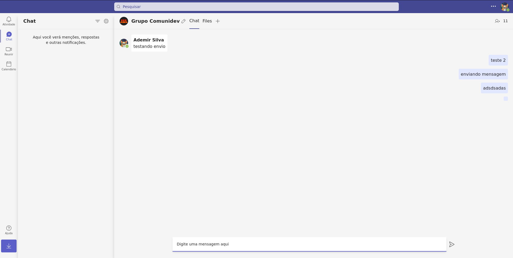

<h1 align="center"> Microsoft Teams Clone #01 </h1>

Bem-vindo ao repositório do Clone do Microsoft Teams! Este é um projeto incrível que busca reproduzir as principais funcionalidades e a experiência do aplicativo de comunicação e colaboração da Microsoft.

  <a href="#-tecnologias">Tecnologias</a>&nbsp;&nbsp;&nbsp;|&nbsp;&nbsp;&nbsp;
  <a href="#-projeto">Projeto</a>&nbsp;&nbsp;&nbsp;|&nbsp;&nbsp;&nbsp;

  

  
  

## 🚀 Tecnologias

Esse projeto foi desenvolvido com as seguintes tecnologias:

- [React](https://react.dev/)
- [Typescript](https://www.typescriptlang.org/)
- [Tailwindcss](Tailwindcss)
- [Firebase](https://firebase.google.com/?hl=pt)
- [Vite](https://vitejs.dev/)
- [Node e NPM](https://nodejs.org/)

## Funcionalidades Principais do Projeto 

O Clone do Microsoft Teams possui uma variedade de funcionalidades, incluindo:

- Criação de login com o google.
- Envio de mensagens de texto e compartilhamento de arquivos.
- Notificações em tempo real para mensagens e chamadas recebidas.

## Contribuição

Contribuições são bem-vindas! Se você deseja colaborar com o projeto, siga estas etapas:

1. Crie um fork deste repositório.
2. Crie uma nova branch com sua funcionalidade ou correção de bug: `git checkout -b minha-branch`.
3. Faça as alterações necessárias e commit as mudanças: `git commit -m 'Minha contribuição'`.
4. Envie as alterações para o seu fork: `git push origin minha-branch`.
5. Abra um pull request neste repositório, descrevendo suas alterações.
